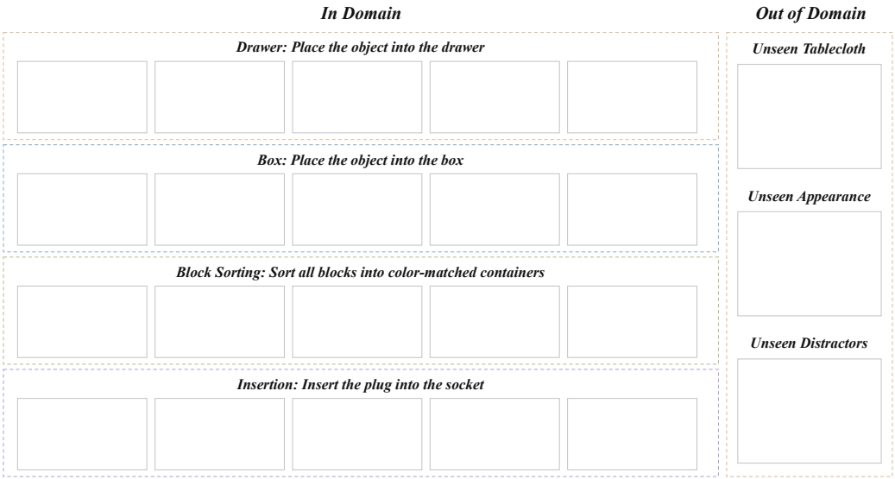

# 第二轮：论文部件与逐句依据

2026-09-29。按用户本轮反馈重建；本文件保存参考与写作判断，Overleaf 保存论文片段。

## 1. 正文设置：一段

先对照的原文：

| 论文 | 位置 | 段落组织 |
|---|---|---|
| [OpenWAM](https://arxiv.org/pdf/2609.07398v1#page=24) | §5.4，pp.24–26 | 平台与任务覆盖 → 评价能力 → 指标 → 附录协议 |
| [FlowWAM](https://arxiv.org/pdf/2607.13017v1#page=8) | §4.3 Setup，p.8 | 平台任务 → 操作要求 → 相同示范 → 随机初始位姿 → 基线 |
| [Efficient-WAM](https://arxiv.org/pdf/2606.10040v3#page=7) | §4.3，p.7 | 平台与观察 → 共享训练数据 → 试验数与时限 |
| [WAM4D](https://arxiv.org/pdf/2606.14048v3#page=10) | §4.3，p.10 | 平台和四任务 → 场景图 → 定量表 |
| [Track4Action](https://arxiv.org/pdf/2608.03727v1#page=5) | §5，pp.5–7 | 四任务、示范、完整成功率与三类真实 OOD |
| [X-WAM](https://arxiv.org/pdf/2604.26694v2#page=19) | Appendix D，pp.19–21 | 真机任务与泛化条件集中放附录 |
| [Fast-WAM](https://arxiv.org/pdf/2603.16666v2#page=7) | Real-World Evaluation，p.7 | 任务能力要求 → 平台示范 → 指标 |

采用 FlowWAM 的短设置段落与 OpenWAM 的附录指向；任务数、平台、方法名单和 OOD 类别来自用户本轮确定的方案。

| 句子 | 本轮稿件 | 对应原文结构与本项目依据 |
|---|---|---|
| M1 | 我们在 UR5e 单臂平台上评估四个真机任务：放入抽屉、放进盒子、积木分类和插接，覆盖抓取放置、多物体操作与精细对齐（图1）。 | WAM4D §4.3 的平台／四任务／图指向；FlowWAM §4.3 按操作要求概括任务。UR5e 和四任务由用户指定。 |
| M2 | 所有方法使用相同的任务示范进行微调，并在分布内（ID）与分布外（OOD）条件下评估；OOD 包括未见桌布、物体外观和干扰物。 | FlowWAM、Efficient-WAM 的共享示范；OpenWAM C.2 的 ID/OOD；X-WAM D 与 Track4Action 的外观泛化。三类条件依用户选择。 |
| M3 | 我们将 MetisWAM4D 与 OpenWAM-Alpha、X-WAM 比较，报告任务成功率。 | Efficient-WAM §4.3 首句列对比方法，OpenWAM §5.4 明确 SR。方法名单来自用户。 |
| M4 | 设置见附录A。 | OpenWAM §5.4 p.25 的协议附录指向；FlowWAM 附录 E 的硬件分工。 |

## 2. 正文结果：一段

先对照的原文：OpenWAM §5.4 p.25 从总体成功率说一般与精细操作；FlowWAM §4.3 p.8 从总体说收益较大的一组任务，再联系表示；X-WAM Appendix D p.20 分开解释泛化条件与精细插入；WAM4D §4.3 p.10 使用几何敏感、接触与长时任务；Track4Action p.7 对照总体与分任务差异；Efficient-WAM p.8 将数值与失败行为连接。

采用“总体 → 外观泛化 → 精细操作”三句。以下是用户要求先写的结果论述草稿；实验数字仍为空，首页标明后续实测核对。

| 句子 | 本轮稿件 | 写法来源与结论来源 |
|---|---|---|
| R1 | 如表1所示，MetisWAM4D 在四个任务上取得最高的平均成功率。 | OpenWAM §5.4、FlowWAM §4.3 的总体结果句式；项目结论为本轮草拟。 |
| R2 | 在未见桌布、物体外观和干扰物下，MetisWAM4D 保持更高的成功率，表现出更强的视觉泛化能力。 | X-WAM D p.20 分条件讨论鲁棒性，Track4Action p.7 对外观 OOD 的定义；对应用户拟展示结论“外观变化下更稳”。 |
| R3 | 相比一般放置任务，需要准确对齐的插接任务提升更明显，体现了任务相关的几何与运动信息对精细操作的作用。 | FlowWAM §4.3 的任务要求与表示收益联系；X-WAM D 的精细插入、WAM4D §4.3 的几何敏感操作；对应用户拟展示结论“精细操作提升更多”。 |

## 3. 正文主表：三行方法，任务下分 ID/OOD

先对照：OpenWAM Table 6（p.25）方法为行、任务为列并报平均；Table 8（p.26）每个任务下分 ID/OOD，OOD 汇总任务的变化条件。X-WAM Table 8（p.21）将具体泛化条件逐列解释；Efficient-WAM Table 2（p.8）紧凑报告真机成功率；WAM4D Table 2 使用方法与任务对照。

本轮采用用户指定的 OpenWAM T6 + T8 组合：三行方法，四任务各 ID/OOD 两列，末尾 ID/OOD 平均。只填成功率（%），主表共 30 个空数值格。任务内部的 OOD 汇总三类条件，四任务平均采用等权。

图表文字逐项核对：

| 位置 | 本轮文字／结构 | 来源 |
|---|---|---|
| 主表 caption 第一句 | 真机任务成功率（%）。 | OpenWAM T6、Efficient-WAM T2 的指标标题。 |
| 主表 caption 第二句 | OOD 汇总未见桌布、物体外观和干扰物三类条件；平均值对四个任务等权计算。 | OpenWAM T8 的 OOD 聚合，T6 的任务平均；具体三类来自用户。 |
| 表头 | 方法；四任务；每组 ID/OOD；平均 | 用户点名的 T6/T8 拓扑。 |
| 表体 | OpenWAM-Alpha、X-WAM、MetisWAM4D | 用户指定的方法名单；浅灰强调本方法参考 OpenWAM T8。 |

## 4. 正文场景图：执行序列 + OOD

先完整查看 OpenWAM Figure 21（p.38），并对照其 Figure 19（p.36）、WAM4D Figure 4、Track4Action Figure 3、X-WAM Figures 3/4。OpenWAM F21 的主体是左侧四行任务、每行五个执行画面；右侧单独展示变化条件，标题用衬线粗斜体，任务行用浅色虚线边界。

本轮原生复刻该构图：

- 左侧四行替换为用户的四任务，每行五个空图框。
- 右侧将参考的四种变化改为本项目三种：未见桌布、外观、干扰物，三个空框纵向排列。
- 所有标题、边界和 23 个照片框都是独立 Draw.io 对象；原图中的照片全部留空。
- 单页原生导出矢量 PDF，2 px 边界；论文以 `width=\textwidth` 接入。

| 图中文字 | 依据 |
|---|---|
| In Domain / Out of Domain | OpenWAM F21 的两分区标题。 |
| 四个任务名及短指令 | 用户任务 + 附录任务指令；语序参考 OpenWAM F19/F21 和 T12。 |
| 三个 Unseen 标题 | X-WAM 的桌布／干扰物，Track4Action 的未见外观；三类由用户收敛。 |
| Caption：真机任务执行过程与评估场景。 | OpenWAM F21 同类图的功能概括。 |
| Caption：左侧为四个任务的执行序列，右侧为未见桌布、物体外观和干扰物三类 OOD 场景。 | 按本图实际左右关系改写 OpenWAM F21 的序列／场景解释。 |

源图见 [Draw.io](../paper/figures/real_world_scenes_20260929.drawio)，[矢量 PDF](../paper/figures/real_world_scenes_20260929.pdf)。

## 5. 附录设置、任务表与平台照片

先对照：OpenWAM C.1/C.2（pp.35–39）、Tables 11/12、Figures 18/20；FlowWAM E.1/E.2（pp.21–22）；Efficient-WAM §4.3（p.7）与 Appendix A（p.14）；WAM4D Table 4（p.10）；X-WAM D；Track4Action p.7 的任务与三类 OOD。

保留四个短段落：平台、任务与示范、OOD、评估协议。任务表按 OpenWAM T12 的两列“任务／指令”，成功终点按 Efficient-WAM 的短协议句组织。硬件图按 OpenWAM F20 单张全景照片的层级留一个 4:3 左右的空框。

| 句子 | 本轮稿件 | 原文写法／本项目事实 |
|---|---|---|
| A1 | 实验平台由 UR5e 机械臂、夹爪、固定主相机和腕部相机构成，如图2所示。 | FlowWAM E.1、OpenWAM C.1 的硬件构成与图指向；UR5e 双视角来自用户基础设施。 |
| A2 | 主相机提供工作空间的 RGB-D 观测，腕部相机提供近距离 RGB 观测；机器人本体状态通过 RTDE 接口读取。 | FlowWAM E.1 的全局／近距相机与控制栈；RGB-D 是本项目采集方案，RTDE 为现有仓库接口。 |
| A3 | 策略根据视觉观测、本体状态与任务指令预测动作，并闭环执行任务。 | Efficient-WAM §4.3 的观察／状态，OpenWAM C.2 的指令与自主执行。 |
| A4 | 四个任务及其语言指令列于表2。 | OpenWAM C.2 p.37 引用 T12。 |
| A5 | 放入抽屉与放进盒子评估相对容器的抓取放置，积木分类要求连续完成多物体操作，插接要求准确的相对姿态与接触对齐。 | FlowWAM E.2 的任务目标描述；Efficient-WAM 的分类；X-WAM 的精细插入；具体四任务来自用户。 |
| A6 | 我们使用遥操作示范对各方法进行微调；同一任务的训练数据在所有方法之间共享。 | FlowWAM §4.3/E.2、Efficient-WAM §4.3 的同数据训练比较。 |
| A7 | 训练与评估时均随机化物体的初始位置。 | 用户本轮明确确定；FlowWAM／Efficient-WAM 的随机初始位姿写法。 |
| A8 | ID 评估沿用训练中的物体与场景配置。 | OpenWAM C.2 的 ID/OOD 对照层级。 |
| A9 | OOD 评估分别更换训练中未见的桌布、目标物体外观，或加入未见干扰物，每次只改变一种因素，并保持任务指令与操作目标一致。 | OpenWAM C.2 p.37 的单因素变化且保持任务目标；类别参照 X-WAM D 与 Track4Action p.7，由用户指定。 |
| A10 | 对于积木分类，外观变化保留颜色类别与容器的对应关系。 | OpenWAM C.2 保持任务目标的原则；Efficient-WAM 分类任务的颜色匹配目标；本项目采用同色不同纹理／材质的外观变化。 |
| A11 | 表1的 OOD 列汇总三类变化条件的成功率。 | OpenWAM T8 的 OOD 列聚合写法。 |
| A12 | 每个任务、每种方法进行 20 次评估，单次时限为 120 秒。 | Efficient-WAM p.7 的试次／时限句式；数值来自用户。ID/OOD 次数分配延续现有讨论，正文使用用户原始口径。 |
| A13 | 成功率以完整任务的完成比例计算。 | OpenWAM C.2 的 final success 与 Track4Action F4 的 full task completion。 |
| A14 | 放置任务要求物体稳定置于指定抽屉或盒子中；积木分类要求所有积木进入对应容器；插接要求插接件完全插入目标孔位。 | Efficient-WAM p.7 的逐任务终点短句、OpenWAM C.1/C.2 的稳定放置与完整完成。具体道具沿用四任务草案。 |
| T2 | 真机任务及语言指令；四条“拿起／放入／分类／插入”指令。 | 用户指定采用 OpenWAM T12 的 task/instruction 两列；分类参照 Efficient-WAM，插接参照 X-WAM 的任务目标。 |
| F2 | 真机实验平台，包括 UR5e 机械臂、夹爪、固定与腕部相机，以及四个任务的操作物体和工作空间。 | OpenWAM F20 的平台／相机／工作空间／道具全景说明；设备换为用户平台。 |

## 6. 这一轮采用的粒度

正文 7 句、附录 14 句；主结果表 3 行方法；任务指令表 4 行；正文 1 张序列与 OOD 合图；附录 1 个平台照片框。示范量和训练超参数在后续训练方案确定时补入。日志字段、预算选项、模板来源与参考映射分别保存在工作记录中。

颜色分类与插接件是本轮任务措辞的具体化；结果论述和主相机 RGB-D 按拟开展实验起草。现有采集代码的深度保存扩展仍见 [数据说明](05_data_and_calibration.md)。
